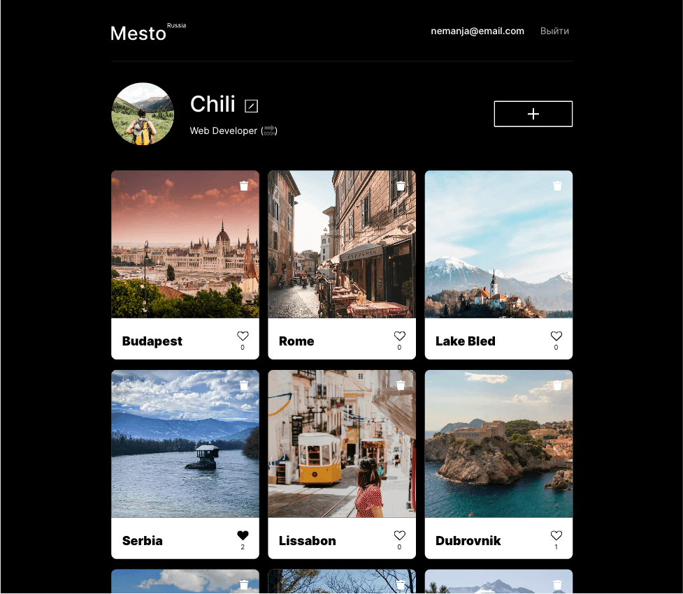
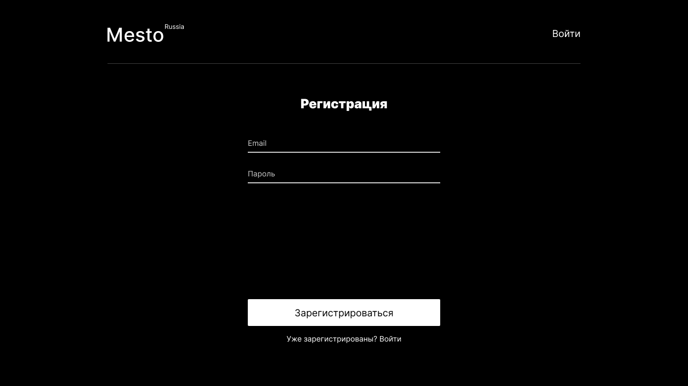
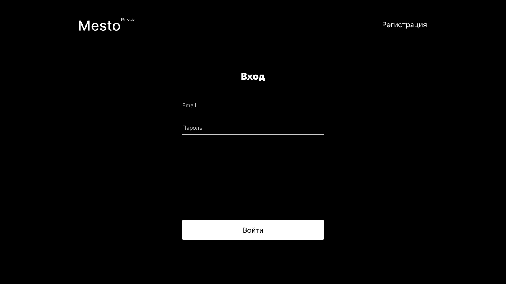
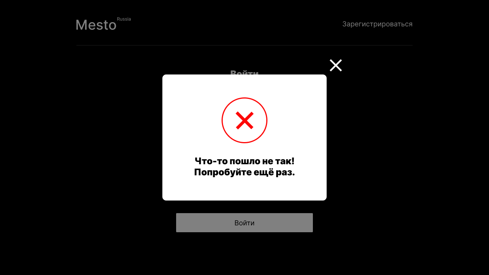
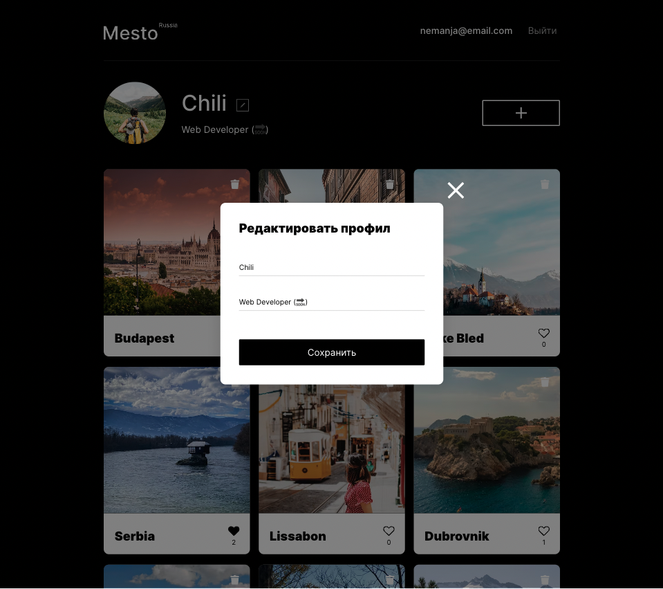
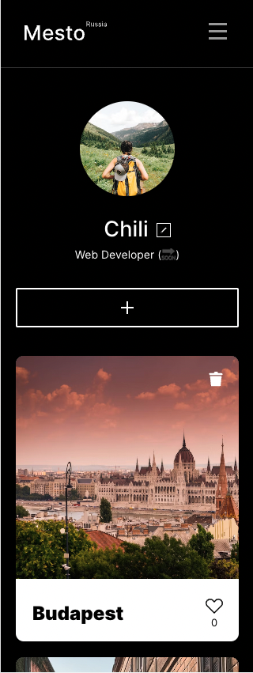
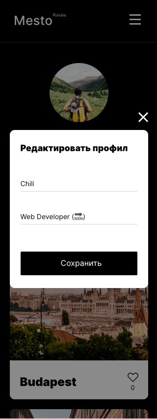

# Mesto

### *Educational purpose project from [Яндекс.Практикум](https://practicum.yandex.ru/web/)*
### A simple interactive single-page service written on React.js

<hr>

[Mesto](https://chili.nomoreparties.co) is a type of Instagram prototype.  
If https://chili.nomoreparties.co (hosting probably expired) is not available you can run Mesto locally.

This project includes [frontend](https://github.com/letStayFoolish/react-mesto-auth) and [backend](https://github.com/letStayFoolish/express-mesto-gha) parts, and it's deployed and developed to practice programming skills.

If you want to create a new user, please, use fake email (for example: test@test.com)

## Functionality

- Edit user's avatar and profile information;
- Add photos and likes;
- Remove photos and likes;
- Open full-screen photos;
- User authorization and registration.

<hr>

## Screenshots

<details><summary><b>Show all</b></summary>







</details>

<hr>

## Technologies:
### Frontend:

- HTML5;
- CSS3:
  - Flexbox;
  - Grid Layout;
  - Positioning;
  - Adaptive UI;
  - Media Queries;
- BEM methodology (nested/flat);
- JavaScript:
  - CamelCase style;
  - Object-oriented programming;
  - Promise, asynchronous functions;
  - API (Application Programming Interface);
- Webpack:
  - Project files are bundled using [Webpack](https://webpack.js.org/) technology, which takes the dependencies and generates a dependency graph allowing web developers to use a modular approach for their web application development purposes.
- React JS:
  - Create React App;
  - JSX;
  - Functional components;
  - Hooks.

### Backend:

- Node.js;
- Express
- MongoDB
- mongoose
- JWT in cookie,
- Nginx
- pm2
- Celebrate
- Winston
- Jest\* (request testing, backend side)


## Connections 

### Server

IP 84.201.158.81  
Frontend: https://chili.nomoreparties.co <br>
Backend: https://api.chili.nomoreparties.co <br>

### Local
Frontend: http://localhost:3000 <br>
Backend: http://localhost:8000 <br>


## How to install and run locally

It may happen that Mesto can not be available due to hosting expiration. You have ability to download and run this app\repo locally.  
So, if you don't want to deploy this app locally, you can also check frontend part using [Mesto frontend](https://github.com/letStayFoolish/react-mesto-auth)

## Usage

### Frontend

* Settings for frontend (./frontend folder). All commands are located in package.json:

Clone repository:

    git clone https://github.com/letStayFoolish/react-mesto-auth
You can do it just by click [here](https://github.com/letStayFoolish/react-mesto-auth).

Install dependencies:

`npm install`

Run app:

`npm run start`

Build app (production):

`npm run build`

### Backend

* Settings for backend (./backend folder). All commands are located in package.json:

Clone repository:

    git clone https://github.com/letStayFoolish/react-mesto-api-full-gha
You can do it just by click [here](https://github.com/letStayFoolish/react-mesto-api-full-gha).

Install dependencies:

    npm install

Run app:

`npm run start` — start server    
`npm run dev` — start server hot-reload


### Directories

`/routes` — folder with routes files;  
`/controllers` — folder with controllers files (users & cards);   
`/models` — folder with schemas (users & cards)

#### API

- Url: https://api.chili.nomoreparties.co or http://localhost:8000
- headers: {  
  'Content-Type': 'application/json',  
  'Accept': 'application/json',  
  }  
  'credentials': 'include'

Available endpoints:
| **Method** | **Endpoint** | **Action** | **Auth required** | **Required body data** |
|------------|------------------|------------------------------------------------------------|--------------------------------------|---------------------------|
| POST | /signup | Create user | | {email: '', password: ''} |
| POST | /signin | Log in | | {email: '', password: ''} |
| GET | /users | Get all users | Yes | |
| GET | /users/:userId | Get user by id | Yes | |
| GET | /users/me | Get info about logged-in user | Yes | |
| PATCH | /users/me | Update description and name of current user | Yes | {name: '', about: ''} |
| PATCH | /users/me/avatar | Update avatar of current user | Yes | {avatar: ''} |
| GET | /cards | Get all cards from gallery | Yes | |
| POST | /cards | Create new card | Yes | {name: '', link: ''} |
| DELETE | /cards/:cardId | Remove card. User has the ability to remove only its own cards | Yes | |
| PUT | /cards/:cardId | Set like | Yes | |
| DELETE | /cards/:cardId | Remove like | Yes | |

## Figma designs:

- [Figma 4](https://www.figma.com/file/2cn9N9jSkmxD84oJik7xL7/JavaScript.-Sprint-4);
- [Figma 5](https://www.figma.com/file/bjyvbKKJN2naO0ucURl2Z0/JavaScript.-Sprint-5);
- [Figma 6-7](https://www.figma.com/file/kRVLKwYG3d1HGLvh7JFWRT/JavaScript.-Sprint-6);
- [Figma 9](https://www.figma.com/file/PSdQFRHoxXJFs2FH8IXViF/JavaScript-9-sprint);
- [Figma 12](https://www.figma.com/file/5H3gsn5lIGPwzBPby9jAOo/JavaScript.-Sprint-12).

## Project's checklists:

- [Checklist 4](https://code.s3.yandex.net/web-developer/checklists/new-program/checklist-4/index.html);
- [Checklist 5](https://code.s3.yandex.net/web-developer/checklists/new-program/checklist-5/index.html);
- [Checklist 6](https://code.s3.yandex.net/web-developer/checklists/new-program/checklist-6/index.html);
- [Checklist 7](https://code.s3.yandex.net/web-developer/checklists/new-program/checklist-7/index.html);
- [Checklist 8](https://code.s3.yandex.net/web-developer/checklists/new-program/checklist-8/index.html);
- [Checklist 9](https://code.s3.yandex.net/web-developer/checklists/new-program/checklist-9/index.html);
- [Checklist 10](https://code.s3.yandex.net/web-developer/checklists/new-program/checklist-10/index.html);
- [Checklist 11](https://code.s3.yandex.net/web-developer/checklists/new-program/checklist-11/index.html);
- [Checklist 12](https://code.s3.yandex.net/web-developer/checklists/new-program/checklist-12/index.html);
- [Checklist 13](https://code.s3.yandex.net/web-developer/checklists-pdf/new-program/checklist_13.pdf);
- [Checklist 14](https://code.s3.yandex.net/web-developer/checklists-pdf/new-program/checklist_14.pdf);
- [Checklist 15](https://code.s3.yandex.net/web-developer/checklists-pdf/new-program/checklist_15.pdf).


## License

````
This project is licensed under the Yandex Practicum License.
````
<hr>

Copyright (c) _2023_ _Nemanja Karaklajic_
