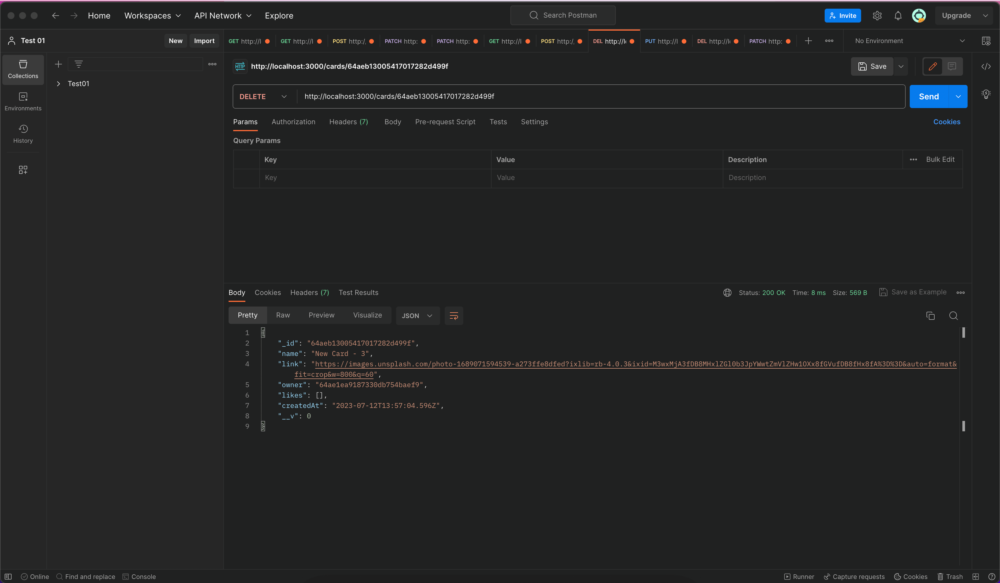

[](../../actions/workflows/tests-13-sprint.yml) [](../../actions/workflows/tests-14-sprint.yml)
# Project Place | Frontend + Backend


### *Educational purpose project from [Яндекс.Практикум](https://practicum.yandex.ru/web/)*

<hr>

## Directories

`/routes` — folder with routes files;  
`/controllers` — folder with controllers files (users & cards);   
`/models` — folder with schemas (users & cards)

## Functionality
USER:
- Request/response to Create new user to database;
- Request/response to Update user's info (name and/or about) on database;
- Request/response to Update user's avatar on database;
- Request/response to Read and send ALL users as an JSON object;
- Request/response to Read and send ONE user as an JSON object;
- 
CARD:
- Request/response to Create new card to a database;
- Request/response to Read and send ALL cards as an JSON object;
- Request/response to Delete and card from database;
- Request/response to Update card's like status: remove/add likes;


<hr>

## Screenshots (from Postman)
<figure>
  
  <figcaption>
    App.js & Postman get request
  </figcaption>
</figure>


<details><summary><b>Show all</b></summary>
<figure>
  
  <figcaption>
    Postman: GET all users request example
  </figcaption>
</figure>
<figure>
  
  <figcaption>
    Postman: GET one user according ID request example
  </figcaption>
</figure>
<figure>
  
  <figcaption>
    Postman: POST create new user request example
  </figcaption>
</figure>
<figure>
  
  <figcaption>
    Postman: PATCH update user's info request example
  </figcaption>
</figure>

<figure>
  
  <figcaption>
    Postman: PATCH update user's avatar request example
  </figcaption>
</figure>

<figure>
  
  <figcaption>
    Postman: GET all cards request example
  </figcaption>
</figure>

<figure>
  
  <figcaption>
    Postman: POST create new card request example
  </figcaption>
</figure>

<figure>
  
  <figcaption>
    Postman: DELETE remove card request example
  </figcaption>
</figure>

<figure>
  
  <figcaption>
    Postman: PATCH put likes on card request example
  </figcaption>
</figure>

<figure>
  
  <figcaption>
    Postman: DELETE dislike card request example
  </figcaption>
</figure>

</details>

<hr>

## Technologies Used

- Node.js;
- Express
- MongoDB
- mongoose
- JavaScript:
  - CamelCase style;
  - Common JS modules;
  - Promise, asynchronous functions;

## Usage

Clone repository:

    git clone https://github.com/letStayFoolish/express-mesto-gha
You can do it just by click [here](https://github.com/letStayFoolish/express-mesto-gha).

Install dependencies:

    npm install

Run app:

`npm run start` — start server    
`npm run dev` — start server hot-reload

## Language:

- JavaScript 

## Libraries & Frameworks:

- Express (Node.js)

[//]: # (## Figma designs:)

[//]: # ()
[//]: # (- [Figma 4]&#40;https://www.figma.com/file/2cn9N9jSkmxD84oJik7xL7/JavaScript.-Sprint-4&#41;;)


## Project's checklists:

- [Checklist 13](https://code.s3.yandex.net/web-developer/checklists-pdf/new-program/checklist_13.pdf).
- [Checklist 14](https://code.s3.yandex.net/web-developer/checklists-pdf/new-program/checklist_14.pdf).

[//]: # (## Deploy)

[//]: # (Check out this website on :)

[//]: # (- [Vercel]&#40;https://react-mesto-auth-delta-one.vercel.app/sign-in&#41;)

## License

````
This project is licensed under the Yandex Practicum License.
````
<hr>

Copyright (c) _2023_ _Nemanja Karaklajic_
